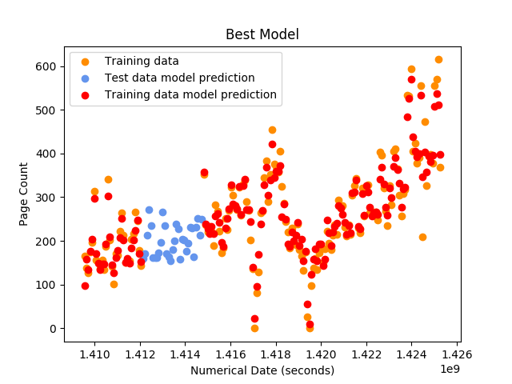
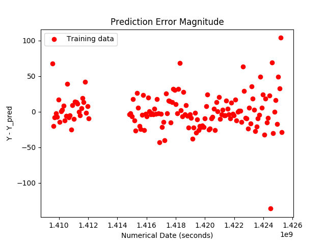

# Machine Learning Example
## Page Count Prediction

In this report, I would be discussing the following:

1. [The training data](README.md#The-training-data)
2. [Regression models evaluated and parameterization](README.md#Regression-models-evaluated-and-parameterization)
3. [Selection of a model for prediction on the test data](README.md#Selection-of-a-model-for-prediction-on-the-test-data)
4. [Model prediction result](README.md#Model-prediction-result)
5. [Answers to addition questions](README.md#Answers-to-addition-questions)

## The training data
The training data included both discrete and continuous feature columns. Columns like “calendar_code” and “events” are discrete. Others, 
such as “site_count”, “min_temp” and “max_temp” are continuous in nature. This fact dictates our choice of models, as will be discussed 
in the next section. The “date” column is converted to seconds and is therefore also a continuous feature column. An additional column 
representing the day of the week was also generated using the datetime module. The “events” feature column is parsed to identify all unique
values, which were then assigned numerical values, thereby making them discrete.  

##	Regression models evaluated and parameterization
Due to the mixed feature types available in our data sets, we decided to evaluate only models that perform well with both discrete and 
continuous features simultaneously. The models evaluated include: (1) Decision Tree Regressor (2) Gaussian Naïve Bayes (3) Random Forest 
Regressor and (4) K-Nearest Neighbor Regressor. The kFold technique was used for cross validation with 10 splits applied to all the models 
evaluated. The scoring technique used was the negative mean square. Key parameters for the four models were also adjusted outside their 
default values in order to further evaluate each model.  For the decision tree regression model the maximum depth parameter is by default 
is unlimited and nodes are expanded until all leaves contain the default minimum sample split, which is 2. However, we adjusted the maximum 
depth parameter to limit the tree depth. For the random forest regression model we adjusted the number of trees in a forest from the 
default value of 10. For the K-nearest neighbor regression model we adjusted the number of neighbors to be used in k-neighbor queries from 
its default value of 5.

##	The selection of a model for prediction using the test data
The model used for prediction was selected based on its performance in predictions on the training data.  The Random Forest Regression 
model performed best particularly for the case where the number of trees was set to 15 (greater than the default) and was therefore 
selected in the evaluation of the test data. 

##	Results
Fig. 1 below shows the prediction results for the test data in blue. It also shows the training data in orange and the prediction results 
for the training data in red. 

Figure 1: Model Prediction (Random Forest Regression Model)
Fig. 2 shows the magnitude of the difference between the predicted page count and actual page count in the training data. As may be 
observed from Fig. 2, the differences between actual and predicted page count is about +/- 50 with a few outliers.

Figure 2: Model Error Magnitude

##	Answers to addition questions
Given that Python starts with 0 = Monday and 6 = Sunday, the day of the week with the highest week of support request is Saturday and that
with the least is Thursday.

